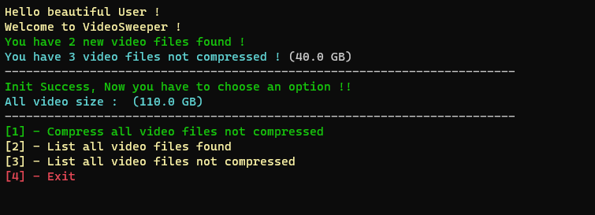
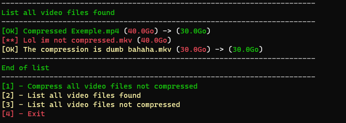
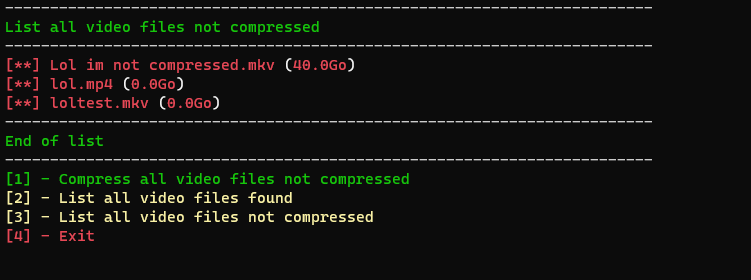
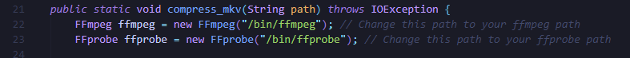

# Video Sweeper

## Table of Contents

- [About](#about)
- [SampleImage](#sampleimage)
- [Getting Started](#getting_started)

## About <a name = "about"></a>

This project is simply way to automate the compression of video files so that they take up less space. This can be very useful for the Plex library owner.

## Sample Image <a name = "sampleimage"></a>


We can see other sample [here](image/)

## Getting Started <a name = "getting_started"></a>

VideoSweeper is a program for compressing video libraries very efficiently. To do this, we use json to store data correctly, so that we know what to do with the different video files. We'll be using ffmpeg for compression. 

The program runs like this and we can see its various functions.
[Click here](#prec) to see how to install it.

```
java -jar videosweeper-1.1.2-jar-with-dependencies.jar
```

Here are the possible options:
- 1 Compress all video files not compressed
- 2 List all video files found
- 3 List all video files not compressed
- 4 Exit

#### Startup Display

#### Option-2 Display

- Green means that the file is compressed
- Red means uncompressed
- Yellow means that compression couldn't do any better than the original file
#### Option-3 Display


### Prerequisites <a name = "prec"></a>

Now we need to check if the project if is ready to run.

On Linux, you can run the following command to check if the project is ready to run.

Check if you have Java on your system.

```
java --version
```

Install ffmpeg on your system and check where it is installed.
```
sudo apt install ffmpeg
where ffmpeg
```
If your ffmpeg installation is installed in /bin/ffmpeg, the program is ready to run, but if it isn't, we need to follow these few steps.
We need to replace the path to ffmpeg and ffmprobe in the class. [compressor](/src/main/java/fr/sstealzz/utilities/Compressor.java).


### Installing

Warning: This step is intended for those who want to compile their programs or who don't have ffmpeg installed in this location (/bin/ffmpeg).

To start with you need to make sure where ffmpeg is located and you need to find the right path to change it here in the compressor class.


You'll need to install maven in order to compile the program with this command at the root of the repo.
```
mvn install
```

You will then have a target file in which your jar file with the dependencies will be generated.